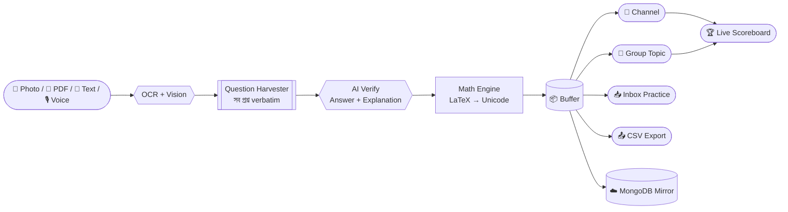

<div align="center">


```
        ╔═══════════════════════════════════════════════════════════╗
        ║   " একটি ছবি দাও... একটি PDF দাও... বাকিটা QUBIX বুঝে নেবে "   ║
        ╚═══════════════════════════════════════════════════════════╝
```

</div>

---

## 🎬 COLD OPEN — the 10-second trailer

```text
▶ 00:01  একজন শিক্ষক একটি প্রশ্নপত্রের ছবি পাঠালেন…
▶ 00:03  ┌ OCR ENGINE ONLINE ──────── scanning ██████████ 100%
▶ 00:05  └ 10 প্রশ্ন detected · ভাষা: বাংলা · বিষয়: পদার্থবিজ্ঞান
▶ 00:07  AI VERIFY → সঠিক উত্তর ✔ · Explanation ✔ · LaTeX → Unicode ✔
▶ 00:09  BUFFER +10  →  CHANNEL POST  →  LIVE SCOREBOARD
▶ 00:10  🏆 QUEST COMPLETE
```

---

## 🕹️ PLAYER SELECT — তিনটি আলাদা ইউনিভার্স

| | 🎓 **STUDENT** | 🛠 **MASTER** | 👑 **OWNER** |
|---|---|---|---|
| **Arena** | নিজের inbox | inbox + নিজের channel/group | পুরো সাম্রাজ্য |
| **Powers** | `.gen` · Practice · CSV | + Channel/Topic/Group post, Anchor | + People analytics, Tokens, Backup, Access |
| **Sees** | শুধু নিজের quiz | শুধু নিজের workspace | সব কিছু |
| **Serial** | নিজের ১ থেকে | নিজের ১ থেকে | নিজের ১ থেকে |

> 🛡️ **TENANT SHIELD** — কেউ কারো channel, group, topic, buffer, serial বা quiz দেখতে পায় না। প্রতিটি account আলাদা universe, আলাদা UI, আলাদা কথা।

---

## ⚙️ THE MACHINE — core loop



---

## 🧨 POWER-UPS (features)

<table>
<tr><td width="50%">

**🧠 UNLIMITED GENERATION**
`.gen 50` · `.gen med 30` · `.gen buet en 40`
টেক্সট, টপিক, ছবি, পোল — যেকোনো কিছুতে reply.

**📸 VERBATIM HARVEST**
পাতায় ১০টি প্রশ্ন? ১০টিই quiz. উত্তর/ব্যাখ্যা ছাপা থাকলে হুবহু, না থাকলে AI বসিয়ে দেয়।

**📄 PDF PAGE RAIDS**
`/pdfpages 1-5` · `.gen 6-10` — নির্দিষ্ট পৃষ্ঠা থেকে batch harvest (max 20 পৃষ্ঠা)।

</td><td width="50%">

**🈁 LANGUAGE LOCK**
বাংলা source → বাংলা quiz. `en` / `bn` / `std` token দিয়ে জোর করে lock.

**➗ MATH SAFE-CARD**
সম্পূর্ণ ও balanced formula ছাড়া card যায় না; `vec{A}`→`A⃗`, `90^circ`→`90°`.

**🏆 SCOREBOARD SAGA**
`/stopquiz` → pause + interim board · `/resumequiz` → ঠিক ওখান থেকেই চালু, শেষে ব্যাচের প্রথম quiz-এ reply করে একটাই final board.

</td></tr>
</table>

---

## 🎮 CONTROLLER MAP

```bash
# ── GENERATE ─────────────────────────────
.gen 20                 # যেকোনো message-এ reply
.gen med|eng|ver|std 30 # exam standard
.gen 1-5                # PDF পৃষ্ঠা range
/pdfpages 2-4           # PDF page harvest

# ── BUFFER ───────────────────────────────
.bc | /buffercount      # count + Inbox/CSV বাটন
.done                   # CSV export + buffer clear
/clear                  # buffer wipe

# ── PUBLISH (Master/Owner) ───────────────
.post <channel#>        # channel-এ post
.pt <group#> <topic#>   # group topic-এ post
.linktopic <t.me/...>   # যেকোনো post-কে anchor
/stopquiz | /resumequiz # pause / resume
/score                  # scoreboard (বাটনেই on/off)

# ── OWNER CONSOLE ────────────────────────
/people /userstats <id> # per-user analytics
/tokens                 # সব bot token (inbox only)
/backup /restore        # MongoDB mirror
```

---

## ☁️ SAVE-GAME — nothing is ever lost

```text
SQLite (live)  ──►  MongoDB Mirror (cloud)
  users · access · tiers · trials · channels · groups · topics
  anchors · buffers · bot tokens · usage analytics · grant log
STATUS: AUTOSAVE ✅   RESTORE: /restore ✅   SUNDAY 03:00 UTC FULL SYNC ✅
```

🔐 **Token vault:** প্রত্যেক user-এর নিজের bot token সংরক্ষিত থাকে এবং **শুধুমাত্র owner-এর private inbox-এ** সম্পূর্ণ আকারে দেখা যায় (`/tokens`, `/userstats <id>`) — অন্য কোথাও কখনো নয়।

---

## 🚀 LAUNCH SEQUENCE

```bash
pip install -r requirements.txt
export BOT_TOKEN="123456:AA..."     # @BotFather
export OWNER_ID="123456789"         # আপনার numeric id
export MONGO_URI="mongodb+srv://…"  # optional cloud mirror
python main.py
```

**Render (Free Web Service)** → New + → Blueprint → Apply → Environment tab-এ উপরের variable বসান।
Health endpoints: `/` (HTML dashboard) · `/healthz` · `/ping` · `/status.json`
UptimeRobot দিয়ে ৫ মিনিট পরপর `/healthz` ping করলে বট ২৪/৭ জাগ্রত।

---

## 🧩 ENGINE ROOM — কেন section ফাইল?

```
bot/
├── config.py        # BOT_TOKEN · OWNER_ID
├── __main__.py      # runner — sections একই globals-এ ক্রমানুসারে exec হয়
└── sections/
    ├── 00_header_imports.py      →  base
    ├── …                          →  core router · OCR · math · rich text
    └── 99zzzz…_token_visibility   →  latest patch (শেষটাই জেতে)
```

মূল script-এ একই function ৪–৫ বার redefine হয়; শেষ definition-ই runtime-এ চলে। তাই patch গুলো **ক্রম অনুযায়ী** আলাদা ফাইল — behaviour ১০০% অপরিবর্তিত, অথচ কোড browsable।
নতুন ফিচার? পরের নম্বরের একটি ফাইল যোগ করুন — এটি আগের সব কিছু override করতে পারবে।

---

<div align="center">


**⟡ QUBIX ROBOT ⟡** · HSC · Admission · Ed-Tech
`/start` দিয়ে গেম শুরু করুন

</div>
